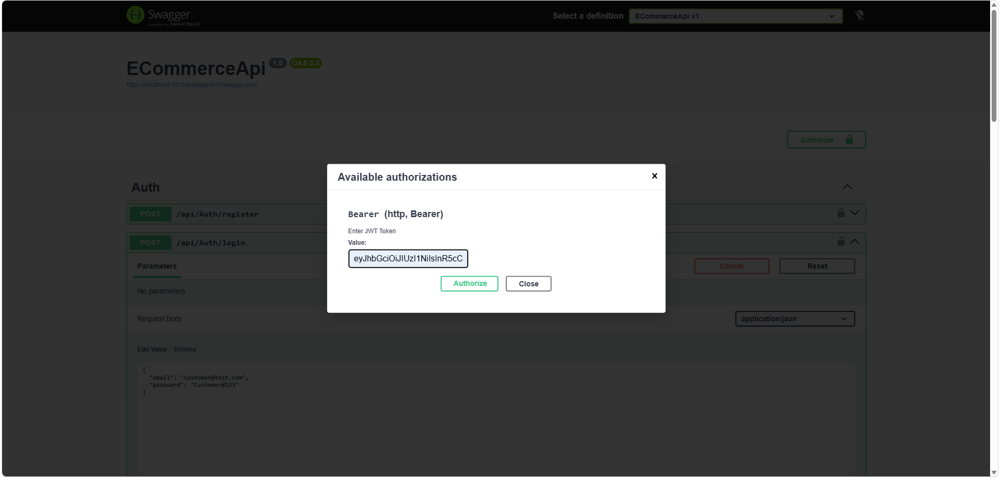
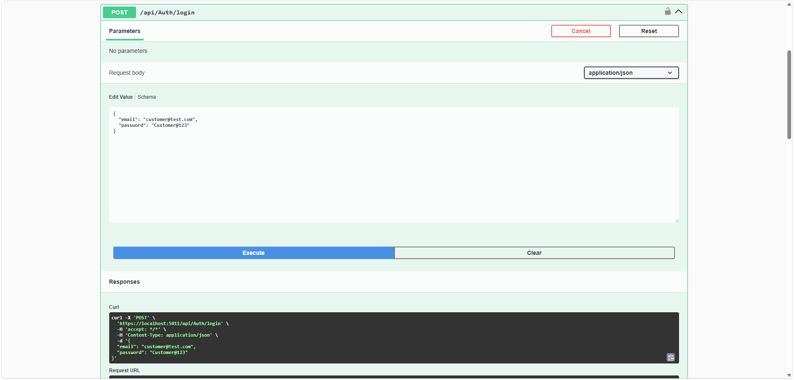
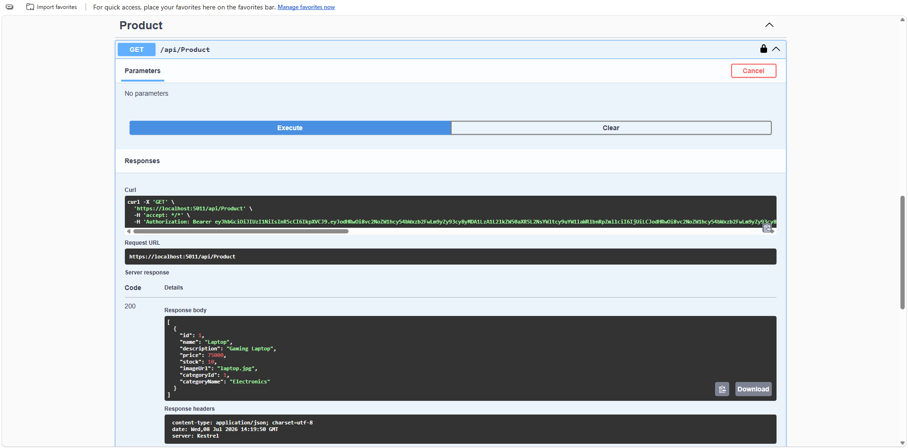
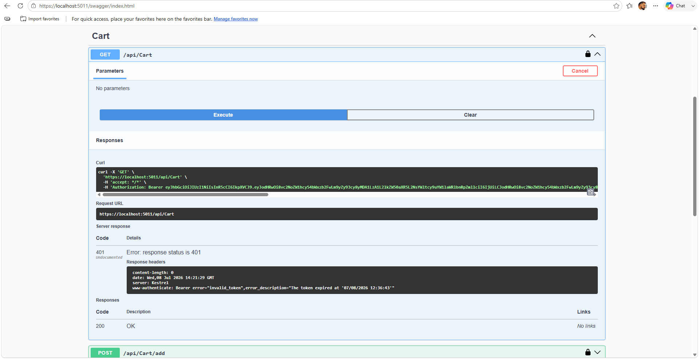
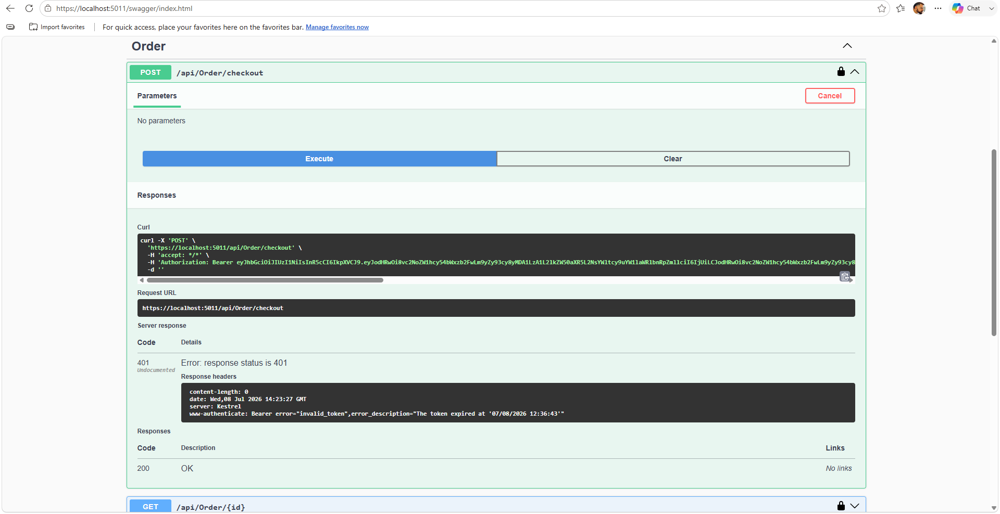

# 🛒 E-Commerce Web API

## 📌 Project Description

E-Commerce Web API is a backend application built using **ASP.NET Core Web API**.

This project provides RESTful APIs for managing users, products, categories, shopping cart, and order processing.

The application follows a clean layered architecture using:

- Repository Pattern
- Service Layer
- DTO Pattern
- Entity Framework Core
- JWT Authentication

The API is tested using Swagger UI.

---

# 🚀 Features

## 🔐 Authentication & Authorization

- User Registration
- User Login
- JWT Token Authentication
- Role Based Authorization
- Protected API Endpoints

---

## 📂 Category Management

- Create Category
- Get All Categories
- Get Category By Id
- Update Category
- Delete Category

---

## 🛍️ Product Management

- Create Product
- Get All Products
- Get Product By Id
- Update Product
- Delete Product

Features:

- Category based products
- Product details management
- DTO based API responses

---

## 🛒 Shopping Cart Module

Users can manage their shopping cart.

Features:

- Add Product to Cart
- View Cart Items
- Update Cart Quantity
- Remove Cart Item
- Clear Cart

---

## 📦 Order Module

Complete checkout flow implementation.

Features:

- Create Order from Cart
- Generate Order Items
- Calculate Total Amount
- View Order Details
- View User Order History

---

# 🏗️ Project Architecture

The project follows a layered architecture:

Controller Layer
|
↓
Service Layer
|
↓
Repository Layer
|
↓
Entity Framework Core
|
↓
SQL Server Database


---

# 📁 Project Structure

ECommerceApi
│
├── Controllers
│
├── DTOs
│
├── Models
│
├── Data
│
├── Interfaces
│
├── Repositories
│
├── Services
│
├── Mappings
│
└── Program.cs

---

# 🛠️ Technologies Used

## Backend

- ASP.NET Core Web API
- C#
- Entity Framework Core
- LINQ

## Database

- SQL Server

## Authentication

- JWT Authentication
- Role Based Authorization

## API Testing

- Swagger UI

## Design Patterns

- Repository Pattern
- Dependency Injection
- DTO Pattern

---

# 🗄️ Database Entities

The application contains the following main entities:

- User
- Category
- Product
- Cart
- CartItem
- Order
- OrderItem

---

# 🔑 JWT Authentication Flow

User Login
|
↓
Generate JWT Token
|
↓
Authorize API Requests
|
↓
Access Protected Endpoints

---

# 📌 API Modules

## Authentication APIs

POST /api/Auth/Register

POST /api/Auth/Login

POST /api/Auth/Register

POST /api/Auth/Login

---

## Product APIs

GET /api/Product

GET /api/Product/{id}

POST /api/Product

PUT /api/Product/{id}

DELETE /api/Product/{id}

---

## Cart APIs

GET /api/Cart

POST /api/Cart/add

PUT /api/Cart/update/{id}

DELETE /api/Cart/remove/{id}

DELETE /api/Cart/clear

---

## Order APIs

POST /api/Order/checkout

GET /api/Order/{id}

GET /api/Order/my-orders

---

# ⚙️ Setup Instructions

## 1. Clone Repository
git clone <repository-url>

---

## 2. Configure Database Connection

Update connection string in:
appsettings.json

Example:

```json
"ConnectionStrings": {
  "DefaultConnection": "Your_SQL_Server_Connection"
}

3. Apply Database Migration

Run:
Update-Database

4. Run Application

Run the project:
dotnet run

Swagger will open:

https://localhost:<port>/swagger

# 📸 Screenshots

## swagger page


## JWT Login Token



## Product API



## Cart API



## Order Checkout



🎯 Learning Outcomes

Through this project, implemented:

- REST API Development
- JWT Authentication
- Entity Framework Core
- Database Relationships
- Repository Pattern
- Service Layer Architecture
- API Documentation using Swagger
- E-Commerce Backend Workflow

👨‍💻 Author

Ajay B